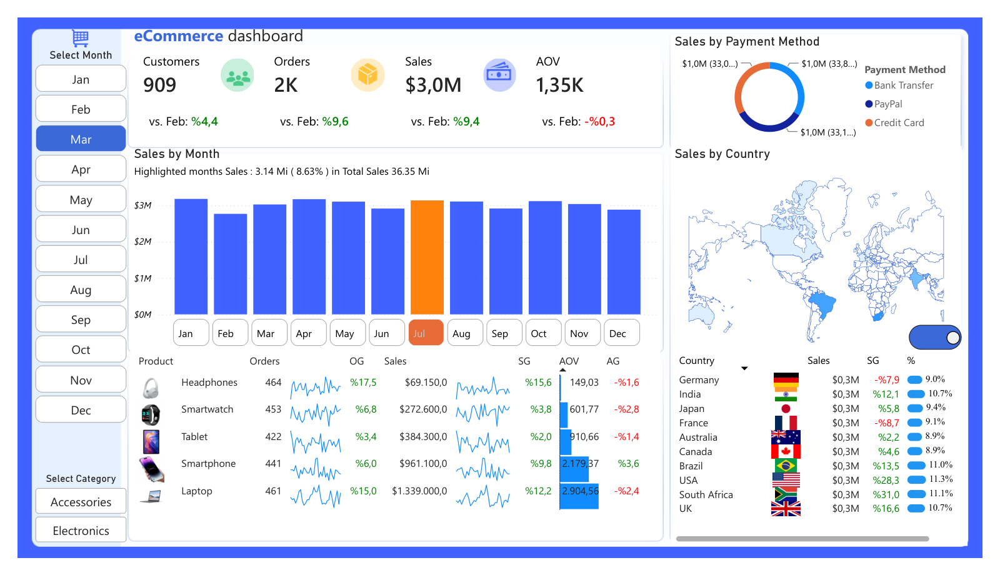

# Training E-Commerce Dashboard

[← Ana sayfa](../README.md)

Bu proje, Power BI egitiminde calistigim e-ticaret dashboard yapisini videoya bakmadan tekrar kurarak gelistirdigim bir calismadir.

Amac, KPI kartlarini, dilimleyici kullanimini, DAX olculerini, grafik duzenini ve dashboard tasarim mantigini kendi basima tekrar uygulayabilmekti.

## Dashboard Preview

Dashboard PDF olarak goruntulenebilir. Power BI dosyasi PBIT (sablon) formatinda indirilebilir; acildiginda veri kaynagi yolu istenir.

- [Dashboard PDF dosyasini goruntule](dashboard.pdf)
- [Power BI PBIT sablonunu indir](dashboard.pbit)

## One Cikan Bulgular

Onizlemedeki gorunumde Mart ayi ve tum kategoriler secilidir.

- Yillik toplam satis 36,35M; aylik satislar yaklasik 2,7M ile 3,2M arasinda dengeli seyrediyor.
- Mart ayinda satis bir onceki aya gore %9,4 artmis, AOV ise %0,3 dusmustur.
- Uc odeme yontemi (Bank Transfer, PayPal, Credit Card) satislari neredeyse esit (~%33) paylasiyor.
- Laptop, siparis adedi diger urunlere yakin olmasina ragmen en yuksek satis tutarini ve AOV'yi uretiyor.

## Dashboard Icerigi

- Customers
- Orders
- Sales
- AOV
- Sales by Month
- Sales by Payment Method
- Product Table
- Sales by Country
- Month Slicer
- Category Slicer

## Uygulanan Konular
- KPI kartlari
- DAX olculeri
- Onceki ay karsilastirmasi
- Buyume orani olculeri
- Kosullu bicimlendirme
- Ay dilimleyici
- Kategori dilimleyici / filtre
- Donut grafigi
- Sutun grafigi
- Dinamik ay vurgulama
- AOV hesaplama
- Odeme turu analizi
- Aylik satis analizi
- Ulke / kita bazli satis analizi

## Kullanilan DAX Olculeri

Bu dashboard'da KPI kartlari, onceki ay karsilastirmalari, buyume oranlari ve kosullu renk formatlari icin DAX olculeri kullanilmistir.

[DAX olculerini goruntule](dax/DAX_Measures.md)

## Proje Amaci

Bu calismanin amaci, egitimde ogrenilen Power BI dashboard yapisini videoya bakmadan tekrar kurarak pratik becerimi gelistirmektir.
