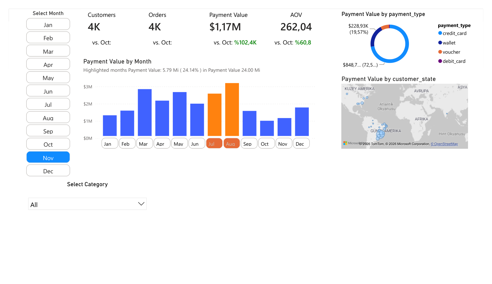

# Brazil Olist E-Commerce Dashboard

[← Ana sayfa](../README.md)

Bu proje, Olist Brazil E-Commerce veri seti uzerinde gelistirdigim Power BI dashboard calismasidir.

Dashboard'da musteri, siparis, odeme tutari, ortalama siparis degeri, odeme tipi, kategori ve eyalet bazli dagilim analiz edilmistir.

## Dashboard Preview

Dashboard PDF olarak goruntulenebilir. Power BI dosyasi PBIT (sablon) formatinda indirilebilir; acildiginda veri kaynagi yolu istenir.

- [Dashboard PDF dosyasini goruntule](dashboard.pdf)
- [Power BI PBIT sablonunu indir](dashboard.pbit)

## Veri Kaynagi

[Brazilian E-Commerce Public Dataset by Olist (Kaggle)](https://www.kaggle.com/datasets/olistbr/brazilian-ecommerce)

Ayni verinin SQL ile analizi ve veri kalite kontrolleri: [E-Commerce Business SQL Analysis](../Ecommerce_Business_SQL_Analysis/README.md)

## One Cikan Bulgular

Onizlemedeki gorunumde Kasim ayi ve tum kategoriler secilidir.

- Grafikteki aylarin toplam odeme tutari 24,00M; en yuksek ay Agustos.
- Temmuz ve Agustos birlikte toplam odeme tutarinin %24,14'unu olusturuyor (5,79M).
- Kasim ayinda odeme tutari Ekim'e gore %102,4, AOV ise %60,8 artmis.
- Odeme tutarinin buyuk kismi (~%72,5) kredi karti ile yapilmis.

## Dashboard Icerigi

- Customers
- Orders
- Payment Value
- AOV
- Payment Value by Month
- Payment Value by Payment Type
- Payment Value by Customer State
- Category Filter
- Month Slicer

## Power BI Dashboardlarda Kullanilan Konular

- KPI kartlari
- DAX olculeri
- Onceki ay karsilastirmasi
- Buyume orani olculeri
- Kosullu bicimlendirme
- Ay dilimleyici
- Kategori dilimleyici / filtresi
- Donut grafigi
- Sutun grafigi
- Harita gorseli
- Dinamik ay vurgulama
- AOV hesaplama
- Odeme turu analizi
- Aylik odeme analizi

## Kullanilan DAX Olculeri

Bu dashboard'da KPI kartlari, onceki ay karsilastirmalari, buyume oranlari ve kosullu renk formatlari icin DAX olculeri kullanilmistir.

[DAX olculerini goruntule](dax/DAX_Measures.md)

## Proje Amaci

Bu projenin amaci, e-ticaret verisi uzerinden temel is metriklerini analiz etmek ve bu metrikleri Power BI dashboard uzerinde anlasilir sekilde sunmaktir.
